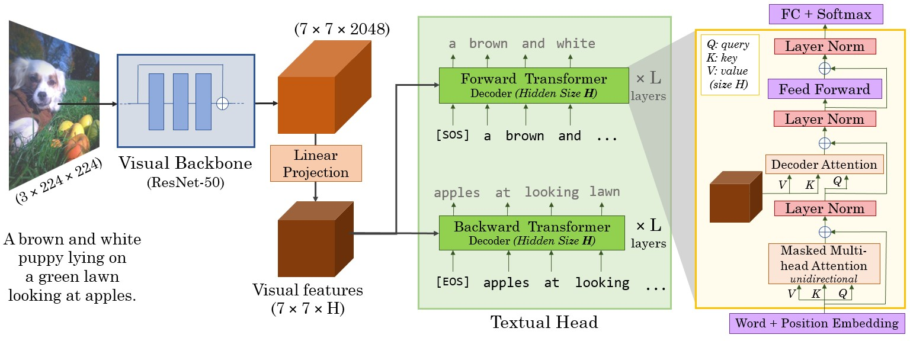

VirTex: Learning Visual Representations from Textual Annotations
================================================================

<h4>
Karan Desai and Justin Johnson
</br>
<span style="font-size: 14pt; color: #555555">
University of Michigan
</span>
</h4>
<hr>

**Preprint:** [arxiv.org/abs/2006.todo][1]

**Model Zoo, Usage Instructions and API docs:** [kdexd.github.io/virtex](https://kdexd.github.io/virtex)

VirTex is a pretraining approach which uses semantically dense captions to
learn visual representations. We train CNN + Transformers from scratch on
COCO Captions, and transfer the CNN to downstream vision tasks including
image classification, object detection, and instance segmentation.
VirTex matches or outperforms models which use ImageNet for pretraining -- 
both supervised or unsupervised -- despite using up to 10x fewer images.




Get the pretrained ResNet-50 visual backbone from our best performing VirTex
model in one line *without any installation*!

```python
import torch

# That's it, this one line only requires PyTorch.
model = torch.hub.load("kdexd/virtex", "resnet50", pretrained=True)
```

Usage Instructions
------------------

1. [How to setup this codebase?][2]  
2. [VirTex Model Zoo][3]  
3. [How to train your VirTex model?][4]  
4. [How to evaluate on downstream tasks?][5]  

These can also be accessed from [kdexd.github.io/virtex](https://kdexd.github.io/virtex).


Citation
--------

If you find this code useful, please consider citing:

```text
@article{desai2020virtex,
  title={VirTex: Learning Visual Representations from Textual Annotations},
  author={Karan Desai and Justin Johnson},
  journal={ TODO },
  year={2020}
}
```


[1]: https://arxiv.org/abs/2006.todo
[2]: https://kdexd.github.io/virtex/virtex/usage/setup_dependencies.html
[3]: https://kdexd.github.io/virtex/virtex/usage/model_zoo.html
[4]: https://kdexd.github.io/virtex/virtex/usage/pretrain.html
[5]: https://kdexd.github.io/virtex/virtex/usage/downstream.html
